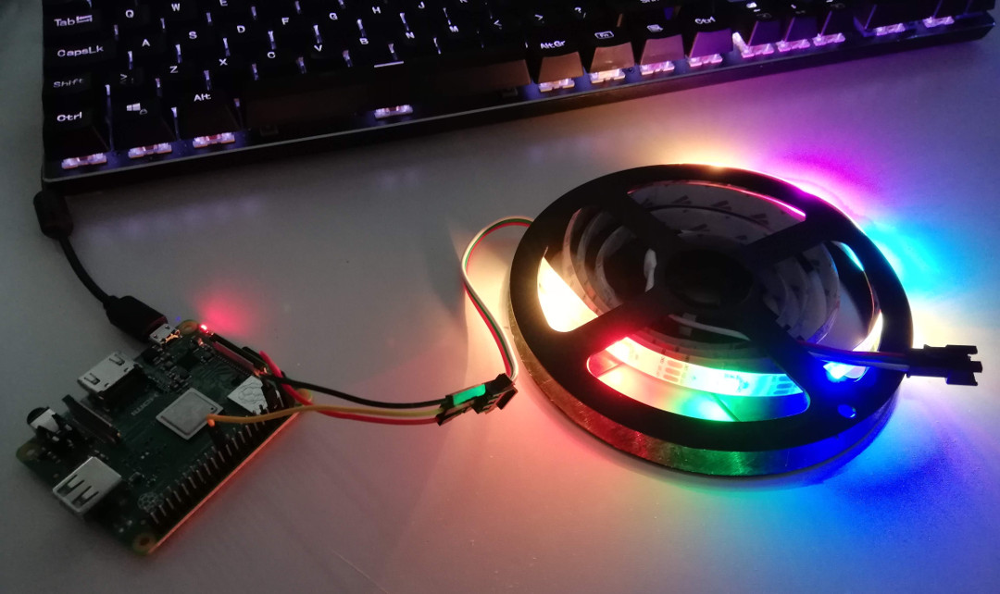
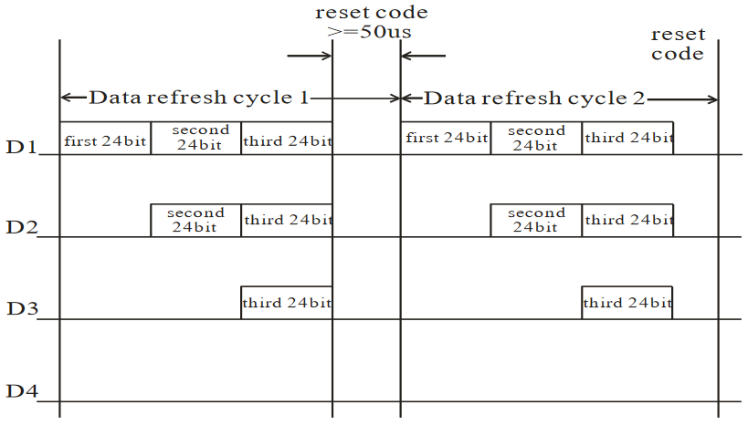

I love messing around with LEDs and now you can do it with .NET Core running on a Raspberry Pi! 




I recently ordered some cheap WS2812B strip from AliExpress ([link here](https://www.aliexpress.com/item/WS2811-WS2812B-ws2812-IC-led-strip-light-30-60-pixels-DC-5V-12V-5050-rgb-individually/32852997981.html)). Also known as [NeoPixels](https://learn.adafruit.com/adafruit-neopixel-uberguide/the-magic-of-neopixels), each individual WS2182B "pixel" consists of an RGB LED and a microchip in a tiny surface-mount package. These are then chained together and controlled with a single GPIO pin of a Raspberry Pi.

The beauty of these are that they can be configured in all sorts of layouts - flexible strip, rings, matrices etc - and are available super cheap. They are controlled using a microprocessor such as an Arduino and now a Raspberry Pi using .NET core thanks to the new [.NET Core IoT Libraries](https://github.com/dotnet/iot) from Microsoft.

The WS2812B strip works by sending a stream of 24bit RGB values followed by a reset code. Each pixel along the chain takes it's value and passes the rest on to the next pixel in the chain. 

Taken from the [datasheet](https://cdn-shop.adafruit.com/datasheets/WS2812B.pdf):



## Setting up your Raspberry Pi

Bear in mind that to use .NET Core on Raspberry Pi, you must be using a RPi2 or RPi3 as .NET Core needs an armv7 CPU. 1st generation Pis and Pi Zero do not have an armv7 chip. {.alert} {.alert-warning}

I started with a [Raspberry Pi 3 Model A+](https://thepihut.com/products/raspberry-pi-3-model-a-plus) with a fresh install of [Raspbian](https://www.raspberrypi.org/downloads/raspbian/).

First you need to install the .NET Core runtime on the Pi. Download the binaries from [https://github.com/dotnet/core-setup](https://github.com/dotnet/core-setup). In the table of builds you need to look for the *Linux (armhf)* platform and at least a 2.2 runtime. 

From your Pi download, extract and then add a link to the runtime with: 

```shell
$ curl -o dotnet.tar.gz https://dotnetcli.blob.core.windows.net/dotnet/Runtime/release/2.2/dotnet-runtime-latest-linux-arm.tar.gz
$ sudo mkdir /opt/dotnet
$ sudo tar xzf dotnet.tar.gz -C /opt/dotnet
$ sudo ln -s /opt/dotnet/dotnet /usr/local/bin
```

You can now check that you have the runtime installed by running `dotnet --info`:
```shell
$ dotnet --info
Host (useful for support):
  Version: 2.2.3
  Commit:  6b8ad509b6

.NET Core SDKs installed:
  No SDKs were found.

.NET Core runtimes installed:
  Microsoft.NETCore.App 2.2.3 [/opt/dotnet/shared/Microsoft.NETCore.App]

To install additional .NET Core runtimes or SDKs:
  https://aka.ms/dotnet-download

```
## Building .NET Core apps for Raspberry Pi

The Raspberry Pi is only supported as a deployment platform - so you cannot compile applications on it. So we are going to swicth back to our desktop machine and make a quick test app:

Make a new application on your desktop machine with `dotnet new console` (I have done it in a folder called `hello-pi`). You will get the default "Hello World" program that you can run locally with `dotnet run`

Program.cs
```cs
using System;

namespace hello_pi
{
    class Program
    {
        static void Main(string[] args)
        {
            Console.WriteLine("Hello Pi!");
        }
    }
}
```

To get this to work on the Pi, we need to first publish it as an arm executable with:

```shell
$ dotnet publish -r linux-arm
```

You then need to send the published output to your Pi. You can copy it to a memory stick or upload it somewher, but I find it's easiest to use _secure copy_ to upload the files over ssh.

Make sure you have enabled ssh access to your Pi by following the instructions [here](https://www.raspberrypi.org/documentation/remote-access/ssh/) {.alert} {.alert-warning}

Just run the following from your desktop machine (replacing `pi` with your username and `raspberrypi` with the name of your Pi):

```shell
$ scp -r bin/Debug/netcoreapp2.2/linux-arm/publish pi@raspberrypi:~/hello-pi
```

Now on your Pi, open the directory and run the app!
```shell
$ cd hello-pi
$ ./hello-pi
Hello Pi!
```

## Playing with the LEDs!

We need to do a few things before we can start lighting the LEDs. Firstly, we need to enable SPI and set the clock speed in the Raspberry Pi's [boot configuration](https://www.raspberrypi.org/documentation/configuration/config-txt/)

On your Pi, edit the `/boot/config.txt' file:
```shell
$ sudo nano /boot/config.txt
```
Edit/add the following lines:
```
dtparam=spi=on
core_freq=250
core_freq_min=250
```

Next we can wire up the strip. I'm using 30 LEDs which can be driven directly from the Raspberry Pi's 5v pin - but if you want more you will need to provide an external 5v source (make sure to connect the grounds if you are doing so).

Connect the strip to the following pins.

Raspberry Pi | WS2812B
------------ | -------
1            | +5v
3            | GND
10           | Din


The pins for reference:


Now we can start coding! You will need to add a reference to the daily feed of `System.Device.Gpio` and `IoT.Device.Bindings` by following the instructions [here](https://github.com/dotnet/iot#how-to-install)

Now create a device
```c#
var count = 30; // number of LEDs
var settings = new SpiConnectionSettings(0, 0) {
                ClockFrequency = 2_400_000,
                Mode = SpiMode.Mode0,
                DataBitLength = 8
            };

var spi = new UnixSpiDevice(settings);
var device = new Ws2812b(spi, count);
```

Now you can simply set the color of each LED!
```c#
BitmapImage image = device.Image;
image.Clear();
image.SetPixel(0, 0, Color.Orange);
device.Update();
```

[See my Gist here](https://gist.github.com/euronay/87e63e44c7f180f94280cab66d4ac3fb) for a sample program you can try immediately - simply follow the [steps](#building.net-core-apps-for-raspberry-pi) above for deploying to your device! 🏮